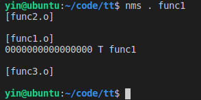
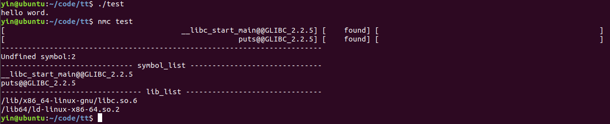

### elf-symbol-check-tool

nms and nmc are python elf symbol check tool based on Linux commands(grep,nm,ldd).  you can use nms to search elf files which contains the symbol and use nmc to check elf file.

### nms

nms usage:  

### nmc

nmc usage:  

